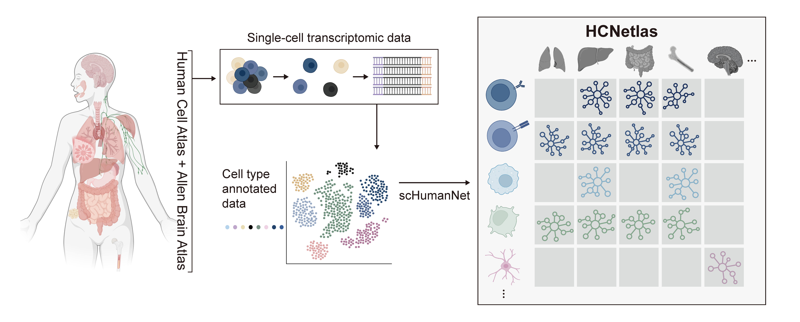
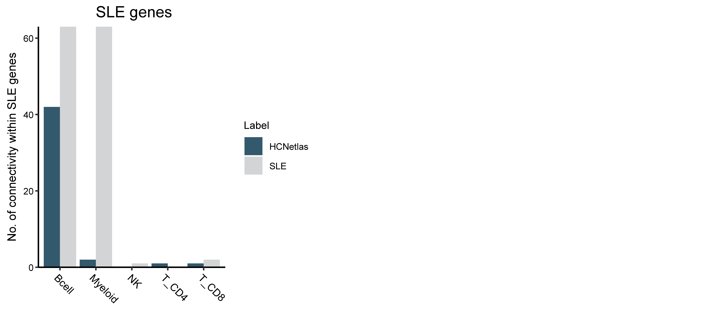

# HCNetlas

Human cell-type-specific network atlas (HCNetlas) with network-based disease analysis with single-cell RNA-sequencing data

### HCNetlas Introduction

HCNetlas comprise of 198 cell-type-specific gene networks (CGNs) built with 25 healthy human tissues and 61 cell types based on single-cell RNA sequencing (scRNA-seq) data. Single-cell transcriptomic data were obtained from the Human Cell Atlas (HCA; [Cross-tissue immune cell atlas (Dominguez Conde et al. Science. 2022)](https://doi.org/10.1126/science.abl5197), [The Tabula Sapiens (The Tabula Sapiens consortium. Science. 2022)](https://doi.org/10.1126/science.abl4896)) and [Allen Brain Atlas](https://portal.brain-map.org/atlases-and-data/rnaseq). CGNs were generated with [scHumanNet (Cha et al. Nucleic Acids Research. 2022)](https://doi.org/10.1093/nar/gkac1042) scRNA-seq network inference package.



### Setting up the Environment

For running HCNetlas, we recommend a `conda` envrionment to install packages in the `packages` folders.

```bash
$ conda create -n HCNetlas R=4
$ git clone https://github.com/netbiolab/HCNetlas.git
$ git clone https://github.com/netbiolab/scHumanNet.git
$ conda activate HCNetlas
(HCNetlas) $ conda install --file ./HCNetlas/requirements_HCNetlas.txt
```

Install the modified version of ACTIONet from scHumanNet package.

```bash
(HCNetlas) $ R CMD INSTALL ./scHumanNet/packages/ACTIONet_2.0.18_HNv3
(HCNetlas) $ cd ./HCNetlas
```

Start R and install SCINET, scHumanNet and HCNetlas.

```r
devtools::install_github("shmohammadi86/SCINET")
devtools::install_github("netbiolab/scHumanNet")
devtools::install_github("netbiolab/HCNetlas")
```

### Load required libraries.

```r
library(HCNetlas)
library(scHumanNet)
library(ACTIONet)
library(SCINET)
library(Seurat)
library(igraph)
library(SingleCellExperiment)
library(purrr)
library(dplyr)
library(stringr)
library(devtools)
library(ggpubr)
```

### Download networks from HCNetlas

Load CGNs from HCNetlas with command `data('HCNetlas_networks')`. Interectomes were loaded as a list with object name `HCNetlas_list`.

```r
data('HCNetlas_networks')
str(HCNetlas_list)
## List of 198
##  $ BLD_Bcell                      :'data.frame':        48984 obs. of  4 variables:
##   ..$ 1            : chr [1:48984] "CD79B" "CMSS1" "LLPH" "NXPE3" ...
##   ..$ 2            : chr [1:48984] "SLC12A6" "LLPH" "WDR46" "TMEM156" ...
##   ..$ LLS          : num [1:48984] 1.7 1.52 1.46 1.57 1.66 ...
##   ..$ scinet_weight: num [1:48984] 2.32 2.49 2.49 3.77 2.35 ...
##  $ BLD_ILC                        :'data.frame':        12543 obs. of  4 variables:
##   ..$ 1            : chr [1:12543] "COPS2" "CLSTN3" "MPIG6B" "ILRUN" ...
##   ..$ 2            : chr [1:12543] "IP6K1" "TATDN2" "PRR36" "IP6K1" ...
##   ..$ LLS          : num [1:12543] 1.47 1.76 1.74 1.47 1.95 ...
##   ..$ scinet_weight: num [1:12543] 2.85 2.26 2.21 3.75 2.97 ...
##  $ BLD_Myeloid                    :'data.frame':        39914 obs. of  4 variables:
##   ..$ 1            : chr [1:39914] "ADGRE5" "IFI27L2" "SETDB1" "EIF4E2" ...
##   ..$ 2            : chr [1:39914] "C19orf24" "KBTBD11" "ZNF556" "FAM110B" ...
##   ..$ LLS          : num [1:39914] 1.78 1.81 1.47 1.47 1.48 ...
##   ..$ scinet_weight: num [1:39914] 2.22 4.05 2.85 2.06 3.98 ...
## ...
```

Command `Tissue()` and `CellType()` gives available tissues and cell types in HCNetlas respectively.

```R
Tissue()
##  [1] "BLD"    "BLR"    "BMA"    "FAT"    "JEJEPI" "JEJLP"  "LARITN" "LIV"
##  [9] "LLN"    "LN"     "LNG"    "M1"     "MG"     "MLN"    "MM"     "MTG"
## [17] "PNC"    "PRS"    "SG"     "SKN"    "SMITN"  "SPL"    "THY"    "TRA"
## [25] "VAS"

CellType()
## [1] "AlveolarMacrophage"          "Astrocyte"
## [3] "Bcell"                       "ClassicalMonocyte"
## [5] "Erythrocyte"                 "ErythrophagocyticMacrophage"
##  ...
```

# Three disease analysis pipelines using HCNetlas as a reference network

HCNetlas serves reference CGNs that can be used for network-based analysis with disease scRNA-seq data. Here, we present three downstream analysis pipelines. Firstly, we propose a differential hubness analysis pipeline. This method, first introduced in the scHumanNet paper, identifies genes with differing centrality between two CGNs. We modified the pipeline to compare two networks to define differential hubness genes directly. Seconly, users can query CGNs in HCNetlas with a gene set to identify relevant cell types in a given disease gene set while comparing the gene set compactness of the gene set in HCNetlas CGNs with that of the disease CGNs. Cell types exhibiting high compactness differences between disease networks and HCNetlas networks demonstrate their association with the disease. Lastly, the top hub genes identified from disease CGNs and HCNetlas CGNs can be compared. Genes with higher hubness indicate their vital role in cell types and disease conditions. Therefore, it is critical to identify these genes in disease-relevant pathway analysis. Further extending examination into direct neighbors also provides insights into the essential roles and state of the cell types.


For an example disease scRNA-seq data, we adapted systemic lupus erythematosus (SLE) scRNA-seq data published in [Nehar-Belaid et al. Nature Immunology 2020](https://doi.org/10.1038/s41590-020-0743-0), publically accessible from [dbGaP Study Accession: phs002048.v1.p1](https://www.ncbi.nlm.nih.gov/projects/gap/cgi-bin/study.cgi?study_id=phs002048.v1.p1). We merged, preprocessed, corrected batch effect and annotated cell types. We selected sequencing data from five SLE patients for our HCNetlas tutorial. Test count data can be accessed below the `data` folder under `cSLE_five_counts` and corresponding metadata with `cSLE_five_metadata.csv` file.

### Build CGNs with scHumanNet

Read disease scRNA-seq data.

```r
counts <- Read10X('data/cSLE_five_counts')
meta <- read.table('data/cSLE_five_metadata.csv', header = T, sep = ',')
rownames(meta) <- meta$X
meta$X <- NULL
```

`getCellType()` function returns cell types of CGNs existing in corresponding tissues in HCNetlas. Since SLE data is obtaned from PBMC data, we will compare it with HCNetlas networks from blood single-cell data. We would match cell-type annotation corresponds with HCNetlas's available cell types.

```r
getCelltype("BLD")

##  [1] "Bcell"             "ILC"               "Myeloid"
##  [4] "Tcell"             "ClassicalMonocyte" "Erythrocyte"
##  [7] "Monocyte"          "NaiveBcell"        "Neutrophil"
## [10] "NK"                "NK_CD16+"          "T_CD4"
## [13] "T_CD8"             "Tmemory_CD4"       "Tmemory_CD8"
## [16] "Tnaive_cm_CD4"     "Tnaive_cm_CD8"


# merge annotated celltypes to larger granularity
meta$celltypes_merged <- ifelse(meta$celltype %in% c('Memory B','Naive B','Plasma cell'), 'Bcell',
                            ifelse(meta$celltype %in% c('CD16- NK', 'CD16+ NK'), 'NK',
                                   ifelse(meta$celltype %in% c('cDC2', 'FCGR3A+ Monocyte','HBA1+ Monocyte','Megakaryocyte','Monocyte'), 'Myeloid',
                                          ifelse(meta$celltype %in% c('Cytotoxic CD8', 'cycling CD8', 'Naive CD8','GZMK+ CD8','MAIT'), 'T_CD8',
                                                 ifelse(meta$celltype %in% c('Naive CD4', 'Th2'), 'T_CD4',
                                                        ifelse(meta$celltype %in% c('RBC','pDC'), 'Others',
                                                               as.character(meta$celltype)))))))

counts_select <- counts[,meta$celltypes_merged != 'Others']
meta_select <- meta[meta$celltypes_merged != 'Others',]
```

### Create sce object

This tutorial converts count data and metadata to sce object with `SingleCellExperiment`, to used it as an intput for network construction.

```r
data <- SingleCellExperiment(assays = list(logcounts = counts_select), colData = meta_select)
```

Prior to scHumanNet construction, reduce data and use the ace class from the ACTIONet package

```r
ace <- reduce.ace(data)
```

The column `celltypes_merged` of the metadata here indicates the column where each barcode is annotated, which will be used as a classification to generate CGNs using scHumanNet.

```r
ace[['Labels']] <- meta_select$celltypes_merged
```

Load HumanNetv3 interactome and retrieve cell-type specific interactions. Command `data('HNv3_XC_LLS')` loads the interactome as an igraph object named `graph.hn3` in package `scHumanNet()`.

```r
data('HNv3_XC_LLS')
ace <- compute.cluster.feature.specificity(ace, ace$Labels, "celltype_specificity_scores")
Celltype.specific.networks = run.SCINET.clusters(ace, specificity.slot.name = "celltype_specificity_scores_feature_specificity")
```

Sort each gene pair alphabetically and add LLS weight from HumanNetv3.
Elements of `sorted.net.list` are stored as edge list. This is later useful for assessing edge overlap between scHumanNets.

```r
sorted.net.list <- SortAddLLS(Celltype.specific.networks, reference.network = graph.hn3)
```

Check each element of list and save scHumanNets, with both SCINET and LLS weights included in the edge list for downstream analysis. R code used to analyze pan-cancer scHumanNet is included in the `figures` folder.

```r
lapply(sorted.net.list, head)

saveRDS(sorted.net.list, '/users/output/sorted_el_list.rds')
```

### Generate merged network list to compare disease CGNs with HCNetlas CGNs.

To combine disease CGNs and HCNetlas CGNs, apply `MergeCGN.HCNetlas()` function.

```r
merged.net.list <- MergeCGN.HCNetlas(sorted.net.list, disease="SLE",tissue="BLD")
```

In this tutorial we will follow the analysis pipeline of `scHumanNet` package which uses degree centrality and their percentile rank to account for network size differences with functions `GetCentrality()` and `CombinePercRank()`.

```r
strength.list <- GetCentrality(method='degree', net.list = merged.net.list)
rank.df.final <- CombinePercRank(strength.list)

# saveRDS(strength.list,'/users/output/strength_list.rds')
# write.table(rank.df.final,'/users/output//rank_df_final.tsv',sep="\t",quote=FALSE)
```

## 1. Differential hubness gene analysis

Genes that significantly changed centrality in disease networks can be regarded as a potential disease marker. Differential hubness gene analysis detects genes with a significance difference in degree centrality percentile rank in two groups.

Get the differential percentile rank value for each genes with function `DiffPR.HCNetlas()`, which is modified function of `DiffPR()` in `scHumanNet` package. The output is a dataframe with genes and the corresponding diffPR value for each cell types. The input of `DiffPR.HCNetlas()` includes the output of CombinePercRank(), two characters refering conditions(disease & control).

```r
diffPR.df <- DiffPR.HCNetlas(rank.df.final, control = 'HCNetlas', disease='SLE')
head(diffPR.df)
```

| Bcell  | Bcell_SLE-HCNetlas | …   | T_CD8  | T_CD8_SLE-HCNetlas |
| ------ | ------------------ | --- | ------ | ------------------ |
| COX4I1 | -1.0000000         | …   | CDC20  | 1.0000000          |
| PET117 | -0.9997210         | …   | KIF14  | 0.9990539          |
| …      | …                  | …   | …      | …                  |
| COX6B1 | -0.9988839         | …   | COX4I1 | -0.9976335         |

The first nonparametric, statistical method to filter differential hubs will be conducted with the function `FindDiffHub.HCNetlas()`. Input requires the output of `CombinePercRank()`, two strings defining conditions of data, network list and disease metadata. The output consists of a gene column, diffPR value sorted from negative to positive value, pvalue, and the celltype. To extract genes, use the `gene` column instead of `rownames()`.

```r
diffPR.df.sig <- FindDiffHub.HCNetlas(rank.df.final, control = 'HCNetlas', disease='SLE', net.list = merged.net.list, centrality = "degree", q.method = "BH", min.cells = 1000, dis.meta = meta_select, celltypes = "celltypes_merged")

diffPR.df.sig
write.table(diffPR.df.sig,'/users/output/diffPR_df_sig.tsv',sep="\t",quote=FALSE)

```

|        | Control_CGNs | Disease_CGNs | gene   | diffPR      | pvalue      | qvalue       | celltype |
| ------ | ------------ | ------------ | ------ | ----------- | ----------- | ------------ | -------- |
| COX4I1 | 1.0000000    | 0            | COX4I1 | -1.0000000  | 9.99784e-07 | 0.0003180742 | Bcell    |
| PET117 | 0.9997210    | 0            | PET117 | -0.9997210  | 9.99784e-07 | 0.0003180742 | Bcell    |
| …      | …            | …            | …      | …           | …           | …            | …        |
| GTF2B  | 0            | 0.003784295  | GTF2B  | 0.003784295 | 0.9915452   | 0.9972133    | T_CD8    |
| LRRC63 | 0            | 0.001892148  | LRRC63 | 0.001892148 | 0.9959316   | 0.9987774    | T_CD8    |

To extract top n percent of diffPR genes, function `TopDiffHub()` in `scHumanNet` package can be used.

```r
diffPR.df.top <- TopDiffHub(diffPR.df, top.percent = 0.05)
diffPR.df.top
```

|         | gene    | diffPR     | top_percentage | celltype |
| ------- | ------- | ---------- | -------------- | -------- |
| FANCA   | FANCA   | -0.9391741 | 0.04984284     | Bcell    |
| LARS2   | LARS2   | -0.9394531 | 0.04961832     | Bcell    |
| …       | …       | …          | …              | …        |
| KIF14.1 | KIF14.1 | 0.9990539  | 0.0004747211   | T_CD8    |
| CDC20.1 | CDC20.1 | 1.0000000  | 0.0002373606   | T_CD8    |

## 2. Network compactness analysis

Next, we propose gene set compactness analysis, accounting for connected disease-related genes in networks. As a disease geneset, SLE-associated genes from KEGG pathway are uploaded in `data` folder with `kegg_hsa05322.tsv` file name. The function `Compactness()` takes merged network list containing both HCNetlas CGNs and disease CGNs, two characters indicating control and disease, and disease gene set. The function returns a dataframe with counts of connections among disease genes in each networks.

```r
#get SLE DB
sle_genes <- read.table('data/kegg_hsa05322.tsv',head=F,sep="\t")
sle_genes <- sle_genes$V1

geneset.conn <- Compactness(net.list = merged.net.list, control = 'HCNetlas', disease = 'SLE', geneset = sle_genes)
geneset.conn
```

|          | Bcell | Myeloid | NK  | T_CD4 | T_CD8 |
| -------- | ----- | ------- | --- | ----- | ----- |
| HCNetlas | 42    | 2       | 0   | 1     | 1     |
| SLE      | 63    | 63      | 1   | 0     | 2     |



## 3. Hub signature analysis

Third, we would select top hub genes and their direct neighbors to perform enrichment analysis.
We will get top 10 central genes with highest degree centraltiy for each celltype with `TopHub()` function in `scHumanNet` package, and obtain their direct neighiboring genes.

```r
top.df <- TopHub(rank.df.final, top.n = 10)

select_celltypes <- c("Bcell","Myeloid","T_CD4","T_CD8","NK")
sel_top.df <- top.df[,grepl(paste(paste0("_",select_celltypes,"$"), collapse="|"), colnames(top.df))] # select cell types of interest (both exists in HCNetlas and disease)
sel_top.df
```

| HCNetlas_Bcell | HCNetlas_Myeloid | …   | SLE_T_CD8 |
| -------------- | ---------------- | --- | --------- |
| COX4I1         | CDC42            | …   | CDC20     |
| PET117         | SDHB             | …   | NDC80     |
| …              | …                | …   | …         |
| UQCR10         | ABCB11           | …   | CDK1      |

Function `GetNeighbors()` gives direct neighboring nodes connected to top hub genes. Input requires output of `TopHub()` and output gives a list of direct neighboring nodes and top hub genes in each network.

```r
direct.neighbors <- GetNeighbors(top.df=sel_top.df, net.list =merged.net.list)
```

In this tutorial, we utilzed `enrichR` package to perform enrichment analysis with GOBP and KEGG pathway gene sets. Function `GSAplot()`

```r
library(enrichR)

# For Top 10 hubness genes
for (i in 1:ncol(sel_top.df)){
  geneset <- colnames(sel_top.df)[i]
  top.genes <- sel_top.df[,geneset]

  # For GOBP 2021 term
  go <- GSAplot(top.genes,'GO_Biological_Process_2021', paste(gsub("_"," ",geneset), 'gene GOBP'),10)
  pdf(paste0("/users/output/GSEA_boxplot_",geneset,"_Top10Hubs_GOBP.pdf"),height=3, width=9)
    print(go)
  dev.off()

  # For KEGG 2021 term
  kegg <- GSAplot(top.genes,'KEGG_2021_Human', paste(gsub("_"," ",geneset), 'gene KEGG'),10)
  pdf(paste0("/users/output/GSEA_boxplot_",geneset,"_Top10Hubs_KEGG.pdf"),height=3, width=6)
    print(kegg)
  dev.off()
}

# For gene sets including direct neighbors
for (i in 1:length(direct.neighbors)){
  geneset <- names(direct.neighbors)[i]
  top.genes <- direct.neighbors[[geneset]]

  # For GOBP 2021 term
  go <- GSAplot(top.genes,'GO_Biological_Process_2021', paste(gsub("_"," ",geneset), 'gene GOBP'),10)
  pdf(paste0("/users/output/GSEA_boxplot_",geneset,"_DirectNeibhbors_GOBP.pdf"),height=3, width=9)
    print(go)
  dev.off()

  # For KEGG 2021 term
  kegg <- GSAplot(top.genes,'KEGG_2021_Human', paste(gsub("_"," ",geneset), 'gene KEGG'),10)
  pdf(paste0("/users/output/GSEA_boxplot_",geneset,"_DirectNeibhbors_KEGG.pdf"),height=3, width=6)
    print(kegg)
  dev.off()
}

```


